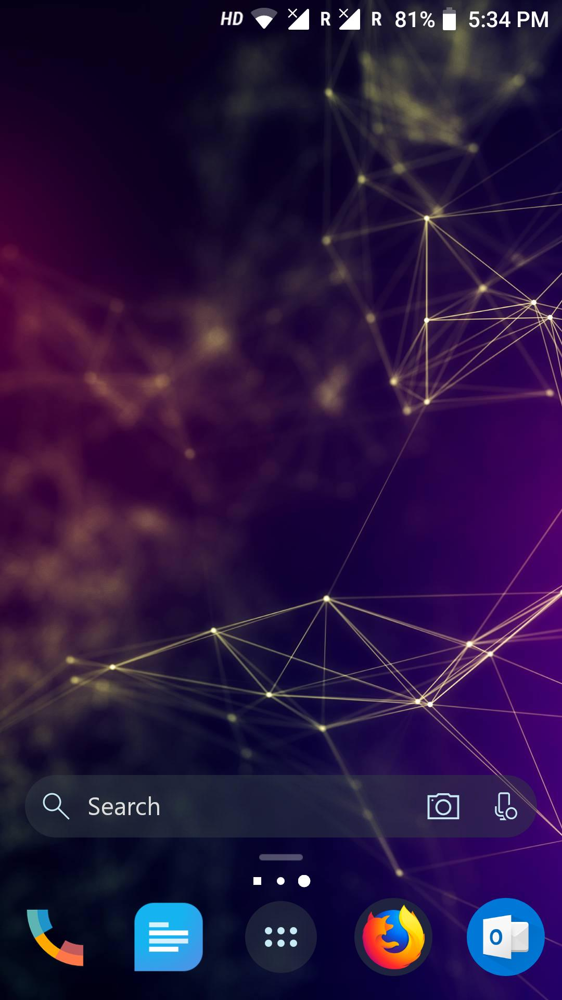
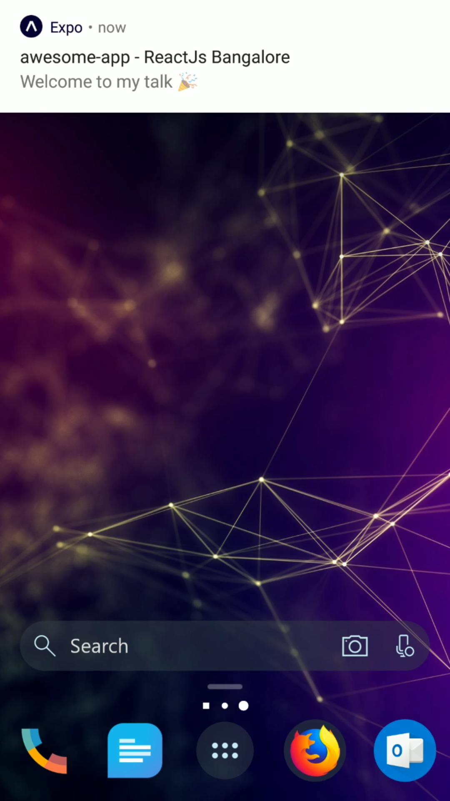
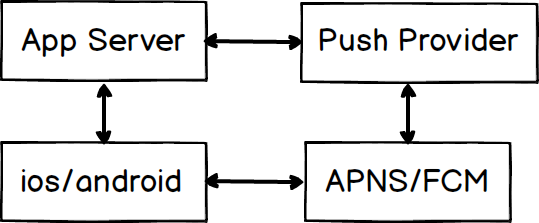

import { Appear, Notes, Head } from "mdx-deck";
import { Split, FullScreenCode } from "mdx-deck/layouts";
import { CodeSurfer } from "mdx-deck-code-surfer";
import prismTheme from "prism-react-renderer/themes/nightOwl";
import okaidia from "react-syntax-highlighter/styles/prism/okaidia";
import { dark } from "mdx-deck/themes";

export const theme = {
  ...dark,
  prism: {
    style: okaidia
  }
};

<Head>
  <title>React native Notifications</title>
  <link rel="stylesheet" href="https://use.fontawesome.com/releases/v5.5.0/css/all.css" crossorigin="anonymous" />
</Head>
---

# React Native Push Notifications 🎡

---

Hello 👋

My name is **Subramanya Chakravarthy ([@chakrihacker](https://twitter.com/chakrihacker))**

Created [react-native-safe-mapview](https://github.com/chakrihacker/react-native-safe-mapview) **🌍**

Software Developer **👨‍💻** @ Platify.co

---



<Notes>What is Push Notification?</Notes>

---

<video width={"300"} height={"600"} autoplay="true" loop="true">
  <source src="./src/assets/notification.mp4" type="video/mp4" />
</video>

<Notes>
  Push Notification is that animation which you receive on your ios phone or an
  android Which helps you trigger an event and get users attention and helps to
  engage with users
</Notes>
---

# Why Notifications?

<div style={{display: "flex", alignItems: "center", justifyContent: "space-between"}}>
  <ul style={{textAlign: "left", fontSize: "50px"}}>
    <Appear>
      <li>Retention</li>
      <li>Engagement</li>
      <li>Get User's Attention</li>
    </Appear>
  </ul>

  
</div>

<Notes>
  There are couple of advantages
  Retention - important aspect of every product. After an app is installed. It is important for a product or a company
  to have that user continuing that app  
  
  Engagement - Like twitter, someone commented on your tweet and you may add another reply

Get User's Attention - Notifications like your mind will blow away after watching this video

</Notes>

---

<div style={{ display: "flex", justifyContent: "space-around" }}>
  <div
    style={{
      display: "flex",
      alignItems: "flex-start",
      flexDirection: "column",
      justifyContent: "start"
    }}
  >
    <h1>Some Numbers...</h1>
    <ul style={{ textAlign: "left", fontSize: "50px" }}>
      <Appear>
        <li>31.84% of all Apps in Android app store include push</li>
        <li>More than 50% of installed apps include push</li>
      </Appear>
    </ul>
  </div>
  
</div>

<Notes>
  How do you find that, any app uses gcm/fcm has push notifications. you can find using appbrain.com and see how many 
  apps are using it

</Notes>

---

# Few important things

<ul style={{ textAlign: "left", fontSize: "50px" }}>
  <Appear>
    <li>Ask user for permission</li>
    <li>Give Context why user should give permission</li>
    <li>Capture Device token and platform</li>
    <li>Preload Content via Push</li>
    <li>Respect user timezone</li>
  </Appear>
</ul>

---

## Notification Types

<ul style={{ fontSize: "50px" }}>
  <Appear>
    <li>Local Notifications</li>
    <li>Push Notifications</li>
  </Appear>
</ul>

<Notes>ways to send notifications to mobile</Notes>

---

# How does it work

1. Identify the User
2. Trigger notification from server/app
3. Handle receiving notifications

---

# App Flow

```bash
|-- Splash
  |-- Auth
    |-- Notification Permission
  |-- Home
    |-- Create Report
```

---

<CodeSurfer
  code={require("!raw-loader!./src/snippets/registerNotification.js")}
  theme={prismTheme}
  lang={"javascript"}
  showNumbers
  steps={[
    { title: "Get Token" },
    { lines: [1], notes: "import required stuff" },
    { lines: [3, 4] },
    { ranges: [[13, 26]] },
    { ranges: [[6, 11]], notes: "send the token to your server" }
  ]}
/>

---

# Push Notifications Flow



---

# Notification Providers

<ul style={{ fontSize: "50px", textAlign: "left" }}>
  <Appear>
    <li>Expo (multiple server sdks)</li>
    <li>One Signal (free, no privacy)</li>
    <li>Firebase (free)</li>
    <li>Amazon SNS (better for aws ecosystem devs)</li>
    <li>Urban Airship</li>
    <li>PushWoosh</li>
  </Appear>
</ul>

---

export default Split;

## How to implement with React Native


---

<div
  style={{
    display: "flex",
    width: "100vw",
    height: "100vh"
  }}
>
  <div
    style={{
      backgroundColor: "#005DC7",
      flexDirection: "column",
      padding: "20px",
      display: "flex",
      flex: 1,
      alignItems: "center",
      justifyContent: "center"
    }}
  >
    <p>Easy Way</p>
    
    <p>Expo</p>
  </div>
  <div
    style={{
      backgroundColor: "#fff",
      color: "#000",
      padding: "20px",
      display: "flex",
      flex: 1,
      flexDirection: "column",
      alignItems: "center",
      justifyContent: "center"
    }}
  >
    <p>Hard Way</p>
    
    <p>Without Expo</p>
  </div>
</div>

---

<div>
  <h2>Thank You!</h2>
  <div style={{ textAlign: "left" }}>
    <p>
      <i class="fab fa-twitter" style={{ color: "#1DA1F2" }} />
      &nbsp;
      <span>@chakrihacker</span>
    </p>
    <p>
      <i class="fab fa-github" style={{ color: "#fff" }} />
      &nbsp;
      <span>@chakrihacker</span>
    </p>
    <p>
      <i class="fas fa-link" style={{ color: "#fff" }} />
      &nbsp;
      <span>chakrihacker.com</span>
    </p>
  </div>
</div>
